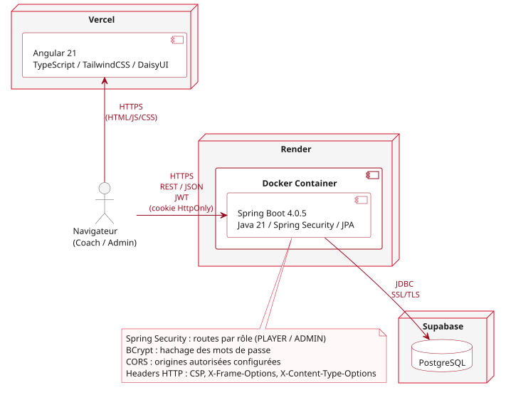

# Documentation de déploiement

Vous trouverez ici les informations concernant le déploiement de l'application fsc-tournament : la vue d'ensemble de l'architecture, puis le déploiement de l'API fsc-tournament-back. Le déploiement de l'interface est documenté dans son propre dépôt.

## 1. Vue d'ensemble



Voici le schéma d'organisation de l'application :

- le navigateur charge l'interface Angular (HTML, JS, CSS) depuis Vercel ;
- le navigateur effectue ensuite lui-même les appels vers l'API fsc-tournament-back, hébergée sur Render dans un conteneur Docker ;
- l'API lit et enregistre les données dans une base PostgreSQL hébergée par Supabase, via une connexion chiffrée (SSL/TLS).

| Élément   | URL publique                                 | Dépôt                                                                          |
| --------- | -------------------------------------------- | ------------------------------------------------------------------------------ |
| Interface | https://fsc-tournament-front.vercel.app/     | [fsc-tournament-front](https://github.com/Laeti-Challant/fsc-tournament-front) |
| API       | https://fsc-tournament-back.onrender.com/api | [fsc-tournament-back](https://github.com/Laeti-Challant/fsc-tournament-back)   |

## 2. Prérequis

### Poste de développement

Pour installer l'application en local :

- Git, pour récupérer le dépôt
- JDK 21, pour compiler et exécuter l'API. La version 21 de Java est nécessaire à Gradle, qui sert à construire l'application Java Spring Boot.
- Docker, pour la base de données et lancer les tests d'intégration qui utilisent Testcontainers

Gradle n'est pas à installer : il est téléchargé par `gradlew` avec la version nécessaire.

### Services en ligne

Pour reproduire le déploiement en production :

- GitHub, pour héberger le dépôt et faire fonctionner la CI
- Render, pour héberger l'API en déployant via GitHub
- Supabase, pour héberger la base de données PostgreSQL

## 3. Configuration

### Les profils

- Le fichier `application.properties` est chargé systématiquement par l'application.
- Le fichier `application-local.properties` le surcharge pour lancer l'application en local.
- Le fichier `application-prod.properties` le surcharge pour le lancement en production, avec des variables d'environnement pour préserver les secrets, à renseigner dans Render.

#### Activation des profils

En production, le `Dockerfile` active le bon profil. En local, il faut lancer l'application avec l'argument suivant :
`--args='--spring.profiles.active=local'`

#### Pour lancer l'application en local

1. Copier le fichier `.env.example` en `.env`, puis compléter le nom de la base, l'utilisateur et le mot de passe.

2. Créer le fichier `src/main/resources/application-local.properties` avec le contenu suivant, en reprenant les valeurs du `.env` :

```properties
jwt.secret=clé à générer, voir ci-dessous

spring.datasource.url=jdbc:postgresql://localhost:5433/nom_de_la_base
spring.datasource.username=nom_de_l_utilisateur
spring.datasource.password=mot_de_passe

app.cors.allowed-origins=http://localhost:4200
app.cookie.secure=false
app.cookie.same-site=Lax
```

La clé JWT doit être encodée en Base64 et faire au moins 256 bits. Pour la générer en local :

```bash
openssl rand -base64 32
```

3. Démarrer la base de données :

```bash
docker compose up -d
```

4. Lancer l'application via Gradle :

```bash
./gradlew bootRun --args='--spring.profiles.active=local'
```

5. L'URL d'appel à l'API est la suivante : `http://localhost:8080/filsanguinairecholetais`

6. Pour arrêter l'application, faire un `Ctrl + C`.

### Les variables d'environnement

| Variable             | Rôle                                              | Exemple                                 | Secret |
| -------------------- | ------------------------------------------------- | --------------------------------------- | ------ |
| POSTGRES_HOST        | hébergeur de la base de données                   | fourni par Supabase                     | Non    |
| POSTGRES_PORT        | port de la base de données                        | 5432                                    | Non    |
| POSTGRES_DB          | nom de la base de données chez l'hébergeur        | postgres                                | Non    |
| POSTGRES_USER        | utilisateur de la base de données                 | -                                       | Oui    |
| POSTGRES_PASSWORD    | mot de passe de la base de données                | -                                       | Oui    |
| JWT_SECRET           | clé secrète pour JWT, en Base64, 256 bits minimum | -                                       | Oui    |
| CORS_ALLOWED_ORIGINS | URL des clients autorisés à appeler l'API         | https://fsc-tournament-front.vercel.app | Non    |
| PORT                 | port d'écoute de l'API                            | 8080 par défaut, fourni par Render      | Non    |

### Les secrets

Ces secrets sont importants car ils préservent l'intégrité de l'application et sa sécurité. Les fichiers `.env` et `application-local.properties` sont systématiquement exclus du dépôt par le `.gitignore`. Pour la mise en production, les secrets sont à enregistrer dans les paramètres du service sur Render, onglet Environment.
